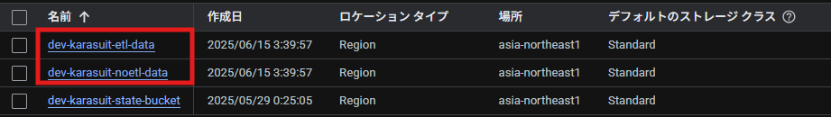
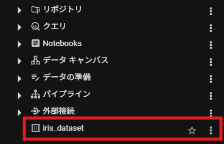
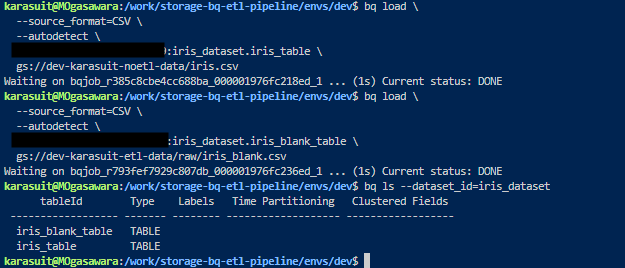
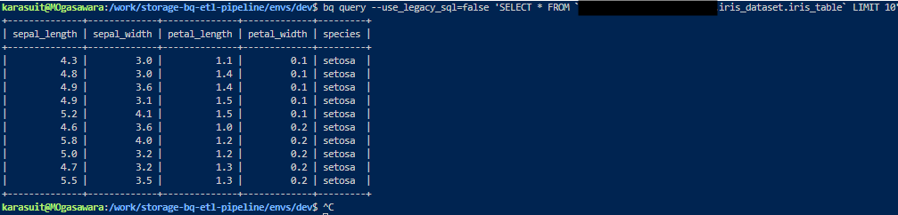
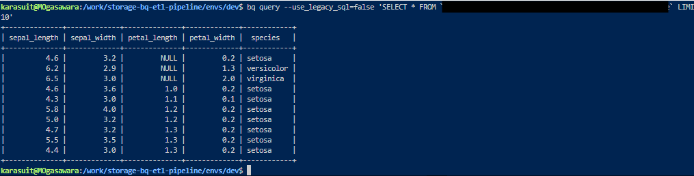

## Phase 1 - BigQuery の Dataset 上でテーブルを作成する

### 概要

Cloud Storage と BigQuery Dataset を terraform を使用しデプロイする。  
Cloud Storage にデフォルトでテーブルにロードする用の csv ファイルを格納する。  
bq コマンドで先述した Dataset にテーブルを作成する。  
※テーブルは、全レコード値があるものと、欠損値(Null)がある 2 テーブルを作成する。

---

### 手順

#### 1. Terraform 用の tf ファイル群を作成

※本レポジトリの tree 構成は以下の通り

<pre><code>
├── data
│   ├── iris.csv
│   └── iris_blank.csv
├── envs
│   └── dev
│       ├── backend.tf
│       ├── locals.tf
│       ├── main.tf
│       ├── outputs.tf
│       └── provider.tf
└── modules
    ├── bq
    │   ├── dataset.tf
    │   ├── outputs.tf
    │   └── variables.tf
    └── storage
        ├── outputs.tf
        ├── storage.tf
        └── variables.tf
</code></pre>

- state 状態を管理するため、Cloud Storage 上に格納する
- 今回は dev 環境のみの構築であるが、stg/prd 環境での構築を想定し、modules から呼び出す構成にしている

#### 2. terraform apply の実施

dev フォルダにカレントディレクトリを移動し、以下のコマンドで GoogleCloud 上にリソースを作成

<pre><code>
terraform init
terraform plan
terraform apply --auto-approve
</code></pre>

#### 3. テーブル作成

ローカル環境上で、以下のコマンドを実施

<pre><code>
bq load \
  --source_format=CSV \
  --autodetect \
  <Project ID>:iris_dataset.iris_table \
  gs://dev-karasuit-noetl-data/iris.csv

bq load \
  --source_format=CSV \
  --autodetect \
  <Project ID>:iris_dataset.iris_blank_table \
  gs://dev-karasuit-etl-data/raw/iris_blank.csv

bq ls --dataset_id=iris_dataset
</code></pre>

ローカル環境上で、以下のコマンドを実施

<pre><code>
bq query --use_legacy_sql=false 'SELECT * FROM `<Project ID>.iris_dataset.iris_table` LIMIT 10'
</code></pre>

