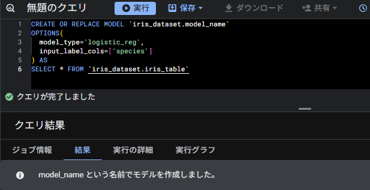
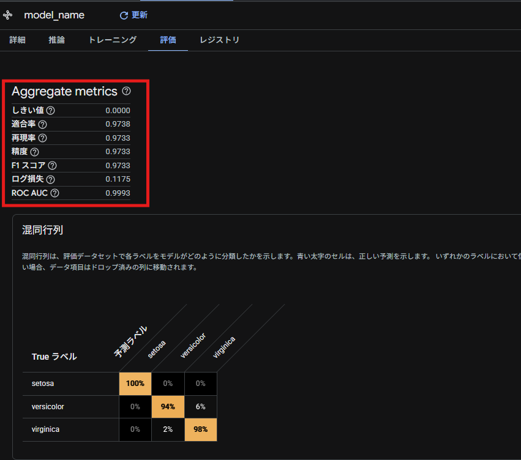
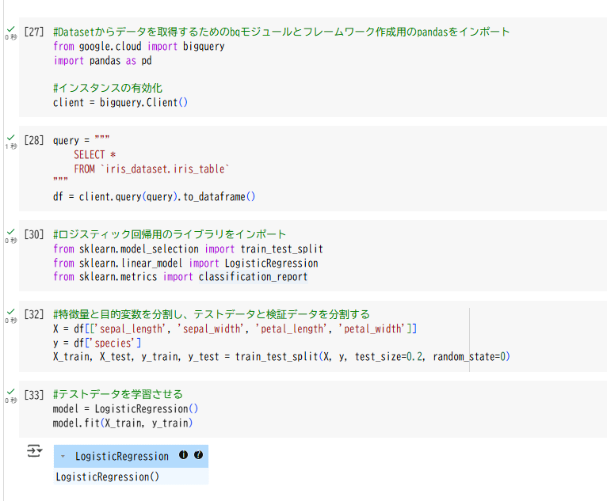
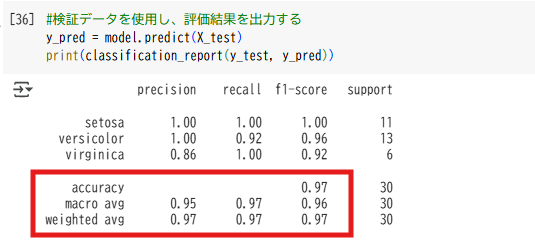

## Phase 2 - テーブル上のデータを元にモデル作成

### 概要

テーブルに格納したデータを元に機械学習用のモデルを作成し、評価する。  
モデルは、ロジスティック回帰モデルを採用し、BiqQuery ML、schikit-learn の 2 パターンで違いを確認する。

---

### 手順

#### 1. BiqQuery ML によるモデルの作成

クエリエディタ上で以下のコマンドを実行する
※目的変数は"species"を使用する。

<pre><code>
CREATE OR REPLACE MODEL `iris_dataset.model_name`
OPTIONS(
  model_type='logistic_reg',
  input_label_cols=['species']
) AS
SELECT * FROM `iris_dataset.iris_table`
</code></pre>

#### 2. モデル(BiqQuery ML)の評価を確認

Google Cloud 上から評価を確認する。  
※BigQuery ML は、デフォルトで 8:2 の割合でテストデータ/検証データに元データを分割し評価している。

※精度が 97%であることから、かなり信憑性の高いモデルであることが分かる。(基本 80%以上が良いとされる)

#### 3. schikit-learn によるモデルの作成

クエリエディタ上の NoteBook で以下のコマンドを実行する
※目的変数は"species"を使用する。

<pre><code>
#Datasetからデータを取得するためのbqモジュールとフレームワーク作成用のpandasをインポート
from google.cloud import bigquery
import pandas as pd

#インスタンスの有効化
client = bigquery.Client()

#テーブルの内容を取得し、データフレーム化
query = """
    SELECT *
    FROM `iris_dataset.iris_table`
"""
df = client.query(query).to_dataframe()

#ロジスティック回帰用のライブラリをインポート
from sklearn.model_selection import train_test_split
from sklearn.linear_model import LogisticRegression
from sklearn.metrics import classification_report

#特徴量と目的変数を分割し、テストデータと検証データを分割する
X = df[['sepal_length', 'sepal_width', 'petal_length', 'petal_width']]
y = df['species']
X_train, X_test, y_train, y_test = train_test_split(X, y, test_size=0.2, random_state=0)

#テストデータを学習させる
model = LogisticRegression()
model.fit(X_train, y_train)
</code></pre>

#### 4. モデル(schikit-learn)の評価を確認

<pre><code>
#検証データを使用し、評価結果を出力する
y_pred = model.predict(X_test)
print(classification_report(y_test, y_pred))
</code></pre>

※精度が 97%であることから、かなり信憑性の高いモデルであることが分かる。
