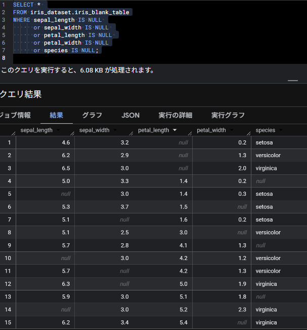
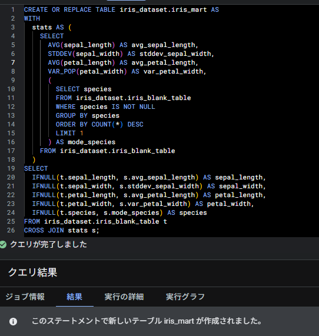
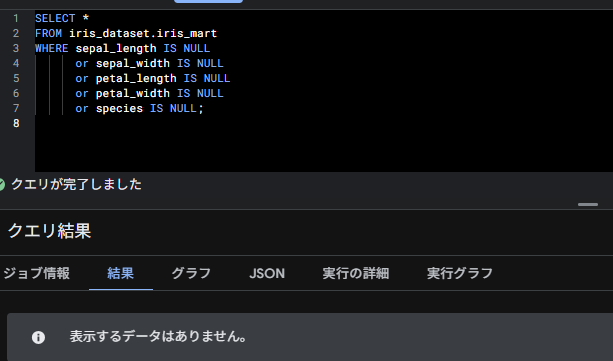
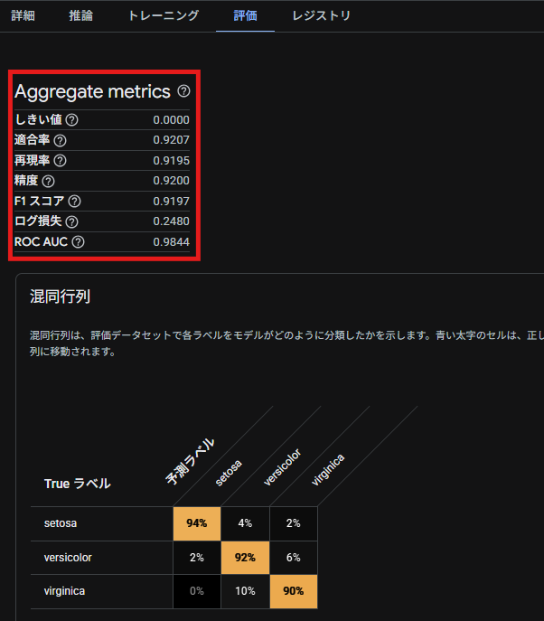

## Phase 3 - Null データを含むテーブルを SQL にて加工したデータマートを作成しモデル作成

### 概要

Storage に格納されたデータが全レコード値が入っていないことを想定し、  
欠損値(Null)がある項目については平均値/分散/最頻値で値を埋めデータマートを作成する。  
上記のデータマートを元に機械学習モデルを作成する。

---

### 手順

#### 1. 欠損値を確認

クエリエディタ上で以下のコマンドを実行する

<pre><code>
SELECT * 
FROM iris_dataset.iris_blank_table
WHERE sepal_length IS NULL 
      or sepal_width IS NULL 
      or petal_length IS NULL 
      or petal_width IS NULL
      or species IS NULL;
</code></pre>

#### 2. データマートの作成

各カラムの Null の値をそれぞれ以下の様に変換して更新した状態のデータマートを作成する

sepal_length ・・・平均値  
sepal_width ・・・標準偏差  
petal_length ・・・平均値  
petal_width ・・・分散  
species ・・・最頻値

<pre><code>
CREATE OR REPLACE TABLE iris_dataset.iris_mart AS
WITH
  stats AS (
    SELECT
      AVG(sepal_length) AS avg_sepal_length,
      STDDEV(sepal_width) AS stddev_sepal_width,
      AVG(petal_length) AS avg_petal_length,
      VAR_POP(petal_width) AS var_petal_width,
      (
        SELECT species
        FROM iris_dataset.iris_blank_table
        WHERE species IS NOT NULL
        GROUP BY species
        ORDER BY COUNT(*) DESC
        LIMIT 1
      ) AS mode_species
    FROM iris_dataset.iris_blank_table
  )
SELECT
  IFNULL(t.sepal_length, s.avg_sepal_length) AS sepal_length,
  IFNULL(t.sepal_width, s.stddev_sepal_width) AS sepal_width,
  IFNULL(t.petal_length, s.avg_petal_length) AS petal_length,
  IFNULL(t.petal_width, s.var_petal_width) AS petal_width,
  IFNULL(t.species, s.mode_species) AS species
FROM iris_dataset.iris_blank_table t
CROSS JOIN stats s;
</code></pre>

クエリエディタ上で以下のコマンドを実行し欠損値がないことを確認する

<pre><code>
SELECT * 
FROM iris_dataset.iris_mart
WHERE sepal_length IS NULL 
      or sepal_width IS NULL 
      or petal_length IS NULL 
      or petal_width IS NULL
      or species IS NULL;
</code></pre>

#### 3. BiqQuery ML によるモデルの作成

クエリエディタ上で以下のコマンドを実行する
※目的変数は"species"を使用する。

<pre><code>
CREATE OR REPLACE MODEL `iris_dataset.model_name`
OPTIONS(
  model_type='logistic_reg',
  input_label_cols=['species']
) AS
SELECT * FROM `iris_dataset.iris_mart`
</code></pre>

#### 4. モデル(BiqQuery ML)の評価を確認

Google Cloud 上から評価を確認する。

※精度が 91%であることから、かなり信憑性の高いモデルであることが分かるが  
Phase2 の時と比べて精度が低いことが分かる。  
