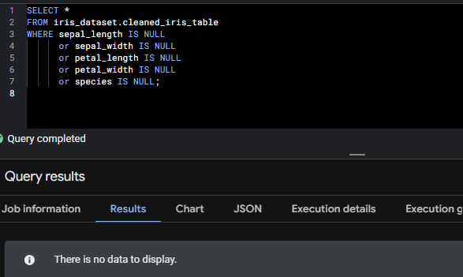
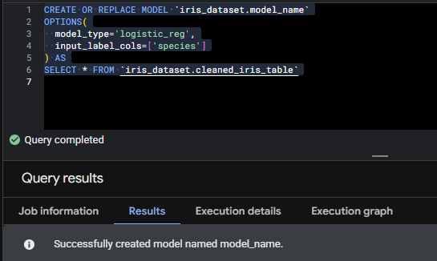
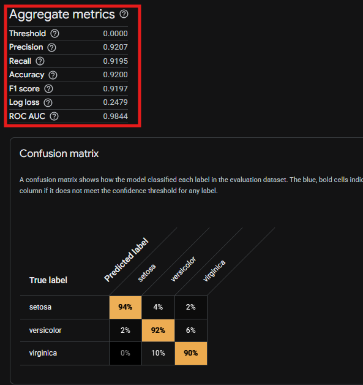

## Phase 4 - Null データを含むデータを ETL 処理後にテーブルを作成しモデル作成

### 概要

Storage に格納されたデータが全レコード値が入っていないことを想定し、　　  
CloudFunction 実行時に格納された CSV のおける欠損値(Null)がある項目については　　
平均値/分散/最頻値で値を埋めた状態に ETL を実施し、Dataset 上にテーブルを作成する Cloud Functions(Python3.10)を作成する。  
上記のテーブルを元に機械学習モデルを作成する。

---

### 手順

#### 1. Terraform 用の tf ファイル群を作成

※本レポジトリの tree 構成は以下の通り

<pre><code>
├── data
│   ├── iris.csv
│   └── iris_blank.csv
├── envs
│   └── dev
│       ├── backend.tf
│       ├── locals.tf
│       ├── main.tf
│       ├── outputs.tf
│       └── provider.tf
├── modules
│   ├── bq
│   │   ├── dataset.tf
│   │   ├── outputs.tf
│   │   └── variables.tf
│   ├── functions (NEW)
│   │   ├── functions.tf
│   │   ├── outputs.tf
│   │   └── variables.tf
│   └── storage
│       ├── outputs.tf
│       ├── storage.tf
│       └── variables.tf
└── src (NEW)
    ├── function.zip
    ├── main.py
    └── requirements.txt
</code></pre>

- state 状態を管理するため、Cloud Storage 上に格納する
- 今回は dev 環境のみの構築であるが、stg/prd 環境での構築を想定し、modules から呼び出す構成にしている

◆main.py

<pre><code>
from google.cloud import storage, bigquery
import pandas as pd
import io

def etl_handler(request):
    # GCSからCSVを読み込み
    storage_client = storage.Client()
    bucket = storage_client.bucket('dev-karasuit-etl-data')
    blob = bucket.blob('raw/iris_blank.csv')
    content = blob.download_as_bytes()

    # pandasでETL処理
    df = pd.read_csv(io.BytesIO(content))
    df.fillna({
        'sepal_length': df['sepal_length'].mean(),
        'sepal_width': df['sepal_width'].std(),
        'petal_length': df['petal_length'].mean(),
        'petal_width': df['petal_width'].var(),
        'species': df['species'].mode()[0]
    }, inplace=True)
    # BigQueryへロード
    bq_client = bigquery.Client()
    table_id = '[Project ID].iris_dataset.cleaned_iris_table'
    job = bq_client.load_table_from_dataframe(df, table_id)
    job.result()

    return 'ETL complete and table created', 200
</code></pre>

#### 2. terraform apply の実施

dev フォルダにカレントディレクトリを移動し、以下のコマンドで GoogleCloud 上にリソースを作成

<pre><code>
terraform init
terraform plan
terraform apply --auto-approve
</code></pre>

#### 3. Cloud Function の実行(Storage→ETL→Table)

ローカル上で以下のコマンドを実行し、Cloud Functions を実行する

<pre><code>
ACCESS_TOKEN=$(gcloud auth print-identity-token)
curl -H "Authorization: Bearer $ACCESS_TOKEN" https://asia-northeast1-[Project ID].cloudfunctions.net/dev-karasuit-etl-function
</code></pre>

iris_dataset 配下に cleaned_iris_table が存在することを確認し、
クエリエディタより、Null 値が存在しないことを確認する

<pre><code>
SELECT * 
FROM iris_dataset.cleaned_iris_table
WHERE sepal_length IS NULL 
      or sepal_width IS NULL 
      or petal_length IS NULL 
      or petal_width IS NULL
      or species IS NULL;
</code></pre>

#### 4. BiqQuery ML によるモデルの作成

クエリエディタ上で以下のコマンドを実行する
※目的変数は"species"を使用する。

<pre><code>
CREATE OR REPLACE MODEL `iris_dataset.model_name`
OPTIONS(
  model_type='logistic_reg',
  input_label_cols=['species']
) AS
SELECT * FROM `iris_dataset.cleaned_iris_table`
</code></pre>

Google Cloud 上から評価を確認する。

※精度が 91%であることから、かなり信憑性の高いモデルであることが分かるが  
Phase2 の時と比べて精度が低いことが分かる。
また Phase3 の時と比べ精度がほとんど一致していることから ETL 処理をあらかじめするか、  
データマートを作成してからモデルを作成するのかで差はないと推察される。
