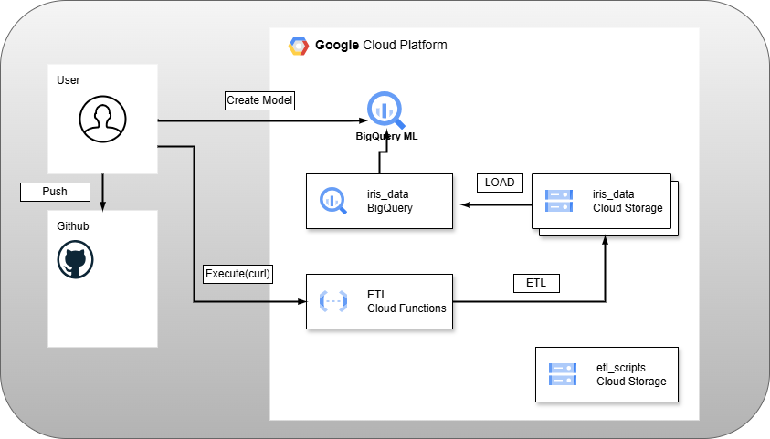

## 概要

Google Storage に分析用のデータを格納し、左記のデータを加工後  
BigQuery 上に取り込み分析できる様にする。  
データをそのまま BigQuery に取り込みデータマートを用意するパターンと  
データの加工を BigQuery へのデータ取り込み前に実施するパターンをそれぞれ検証する

## 目的

- BigQuery の操作を出来るようにする
- データレイク(BigQuery) → DWH(BigQuery) → データマートの一連の構成を GoogleCloud 環境上で構築できるようになる
- ETL を GoogleCloud 上で実施する場合の方法を手を動かして身に着ける

## アーキテクチャ図

## 前提条件

- GitHub 上に以下のリポジトリを作成しておく：
- [storage-bq-etl-pipeline](https://github.com/Karasu1t/storage-bq-etl-pipeline)
- GoogleCloud アカウントを作成し、予め必要な API の有効化および terraform のための ServiceAccount を作成している
- 本学習を進めるにあたり以下のバージョンで実施しています。

1.  OS Ubuntu(WSL) 5.15.167.4-microsoft-standard-WSL2
2.  Terraform v1.12.1
3.  Google Cloud SDK 522.0.0
4.  bq 2.1.16

## フェーズ構成

本環境構築は以下のフェーズに分けて進める：

1. **Cloud Storage と BigQuery Dataset をデプロイし Cloud Storage に格納した csv を元にテーブルを作成できること**
2. **テーブル上のデータを元にモデル作成が出来ること**
3. **Null データを含むテーブルを SQL にて加工したデータマートを作成しモデル作成が出来ること**
4. **Null データを含むデータを ETL 処理後にテーブルを作成し、モデル作成が出来ること**

---

各フェーズの詳細手順や設定内容については、以降のセクションに記載。

[Phase 1 - BigQuery の Dataset 上でテーブルを作成する](https://github.com/Karasu1t/storage-bq-etl-pipeline/blob/main/Phase1.md)  
[Phase 2 - テーブル上のデータを元にモデル作成](https://github.com/Karasu1t/storage-bq-etl-pipeline/blob/main/Phase2.md)  
[Phase 3 - Null データを含むテーブルを SQL にて加工したデータマートを作成しモデル作成](https://github.com/Karasu1t/storage-bq-etl-pipeline/blob/main/Phase3.md)  
[Phase 4 - Null データを含むデータを ETL 処理後にテーブルを作成しモデル作成](https://github.com/Karasu1t/storage-bq-etl-pipeline/blob/main/Phase4.md)

## 注意事項

- ServiceAccount の権限については事前定義ロールを使用
- dev フォルダ配下に locals.tf が本来あるがプロジェクト ID の記載があるため、セキュリティの兼ね合いで git 上に掲載せず
- ServiceAccount の key についても同様
